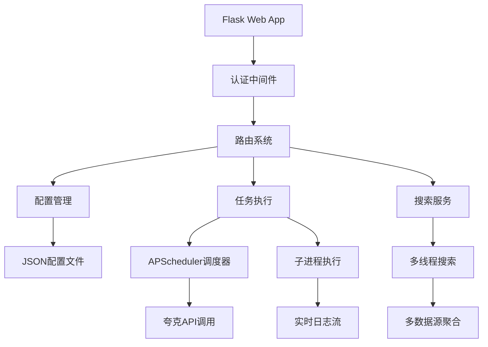
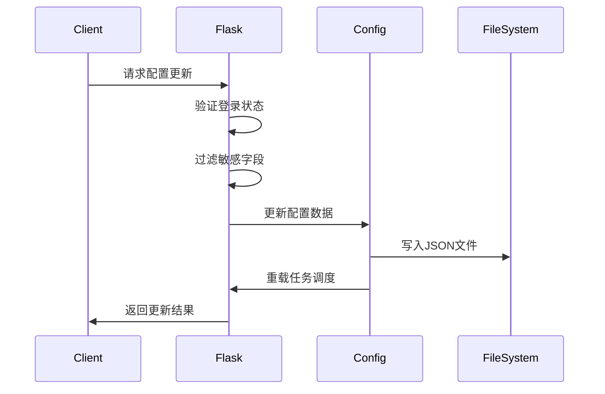

# 📋 app/run.py 详细分析

## 🏗️ 文件整体结构分析

### 1. 导入和依赖分析

```python
# 标准库导入
from flask import (Flask, request, jsonify, render_template, session, ...)
from apscheduler.schedulers.background import BackgroundScheduler
from concurrent.futures import ThreadPoolExecutor, as_completed
from datetime import timedelta
import subprocess, requests, hashlib, logging, sys, os, re

# 项目内部导入
from quark_auto_save import Quark, Config, MagicRename
from sdk.cloudsaver import CloudSaver
from sdk.pansou import PanSou
```

**依赖分析**：
- **Flask**: Web 框架核心
- **APScheduler**: 后台任务调度
- **ThreadPoolExecutor**: 并发处理多个搜索源
- **项目模块**: 夸克API、配置管理、魔法重命名

### 2. 配置和环境变量

```python
# 行 68-77: 配置参数
PYTHON_PATH = "python3" if os.path.exists("/usr/bin/python3") else "python"
SCRIPT_PATH = os.environ.get("SCRIPT_PATH", "./quark_auto_save.py")
CONFIG_PATH = os.environ.get("CONFIG_PATH", "./config/quark_config.json")
HOST = os.environ.get("HOST", "0.0.0.0")
PORT = os.environ.get("PORT", 5000)  # 注意：默认端口是5000
```

**配置特点**：
- 环境变量优先，提供默认值
- 跨平台Python路径检测
- 可配置的配置文件路径

## 🔧 核心初始化分析

### 1. Flask 应用初始化 (行 81-89)

```python
app = Flask(__name__)
app.config["APP_VERSION"] = get_app_ver()
app.secret_key = "ca943f6db6dd34823d36ab08d8d6f65d"
app.config["SESSION_COOKIE_NAME"] = "QUARK_AUTO_SAVE_SESSION"
app.config["PERMANENT_SESSION_LIFETIME"] = timedelta(days=31)
app.json.ensure_ascii = False
app.json.sort_keys = False
app.jinja_env.variable_start_string = "[["  # 避免与模板冲突
app.jinja_env.variable_end_string = "]]"
```

**关键特性**：
- 长期会话 (31天)
- 中文JSON支持
- 自定义模板标记符

### 2. 日志配置 (行 92-101)

```python
logging.basicConfig(
    level=logging.DEBUG if DEBUG else logging.INFO,
    format="[%(asctime)s][%(levelname)s] %(message)s",
    datefmt="%m-%d %H:%M:%S",
)
if not DEBUG:
    logging.getLogger("werkzeug").setLevel(logging.ERROR)  # 生产环境过滤噪音
```

### 3. 安全认证机制 (行 104-122)

```python
def gen_md5(string):
    md5 = hashlib.md5()
    md5.update(string.encode("utf-8"))
    return md5.hexdigest()

def get_login_token():
    username = config_data["webui"]["username"]
    password = config_data["webui"]["password"]
    return gen_md5(f"token{username}{password}+-*/")[8:24]  # 截取16位token

def is_login():
    login_token = get_login_token()
    if session.get("token") == login_token or request.args.get("token") == login_token:
        return True
    return False
```

**安全设计**：
- MD5哈希 + 盐值 (`+-*/`)
- Token 截取防止长度攻击
- 支持Session和URL参数两种认证方式

## 🌐 Flask 路由系统分析

### 1. 认证路由 (行 134-154)

```python
@app.route("/login", methods=["GET", "POST"])
def login():
    if request.method == "POST":
        # 表单认证逻辑
        if (username == request.form.get("username")) and \
           (password == request.form.get("password")):
            session["token"] = get_login_token()
            return redirect(url_for("index"))
        else:
            return render_template("login.html", message="登录失败")

    if is_login():  # 已登录用户直接跳转
        return redirect(url_for("index"))
    return render_template("login.html")
```

### 2. 主要功能路由

#### 📊 数据获取接口 (行 175-183)

```python
@app.route("/data")
def get_data():
    if not is_login():
        return jsonify({"success": False, "message": "未登录"})

    data = Config.read_json(CONFIG_PATH)
    del data["webui"]  # 移除敏感信息
    data["api_token"] = get_login_token()  # 提供API访问token
    data["task_plugins_config_default"] = task_plugins_config_default
    return jsonify({"success": True, "data": data})
```

#### ⚙️ 配置更新接口 (行 187-203)

```python
@app.route("/update", methods=["POST"])
def update():
    global config_data
    dont_save_keys = ["task_plugins_config_default", "api_token"]  # 黑名单

    for key, value in request.json.items():
        if key not in dont_save_keys:
            config_data.update({key: value})

    Config.write_json(CONFIG_PATH, config_data)
    if reload_tasks():  # 重新加载定时任务
        return jsonify({"success": True})
```

**安全机制**：
- 键名黑名单防止覆盖敏感数据
- 全局变量更新
- 自动重载调度器

### 3. 核心业务接口

#### 🚀 手动执行任务 (行 207-253)

```python
@app.route("/run_script_now", methods=["POST"])
def run_script_now():
    tasklist = request.json.get("tasklist", [])
    command = [PYTHON_PATH, "-u", SCRIPT_PATH, CONFIG_PATH]

    def generate_output():
        process_env = os.environ.copy()
        # 环境变量注入
        if request.json.get("quark_test"):
            process_env["QUARK_TEST"] = "true"
            process_env["COOKIE"] = json.dumps(request.json.get("cookie", []))
            process_env["PUSH_CONFIG"] = json.dumps(request.json.get("push_config", {}))

        if tasklist:
            process_env["TASKLIST"] = json.dumps(tasklist, ensure_ascii=False)

        # 实时输出流
        process = subprocess.Popen(command, stdout=subprocess.PIPE,
                                 stderr=subprocess.STDOUT, env=process_env)

        for line in iter(process.stdout.readline, ""):
            yield f"data: {line}\n\n"  # Server-Sent Events

        yield "data: [DONE]\n\n"

    return Response(stream_with_context(generate_output()),
                  content_type="text/event-stream;charset=utf-8")
```

**技术亮点**：
- **Server-Sent Events**: 实时流式输出
- **环境变量注入**: 灵活的参数传递
- **进程管理**: 完整的子进程生命周期

#### 🔍 任务建议搜索 (行 256-324)

```python
@app.route("/task_suggestions")
def get_task_suggestions():
    query = request.args.get("q", "").lower()
    deep = request.args.get("d", "").lower()

    # 并发搜索多个数据源
    with ThreadPoolExecutor(max_workers=3) as executor:
        features = []
        features.append(executor.submit(net_search))      # 网络搜索
        features.append(executor.submit(cs_search))       # CloudSaver搜索
        features.append(executor.submit(ps_search))       # PanSou搜索

        search_results = []
        for future in as_completed(features):
            result = future.result()
            search_results.extend(result)

    # 去重和排序
    results = []
    link_array = []
    search_results.sort(key=lambda x: x.get("datetime", ""), reverse=True)
    for item in search_results:
        url = item.get("shareurl", "")
        if url != "" and url not in link_array:
            link_array.append(url)
            results.append(item)

    return jsonify({"success": True, "data": results})
```

**并发模式**：
- ThreadPoolExecutor 并发执行
- 自动去重和排序
- 多数据源聚合

### 4. 分享详情接口 (行 327-407)

```python
@app.route("/get_share_detail", methods=["POST"])
def get_share_detail():
    if not is_login():
        return jsonify({"success": False, "message": "未登录"})

    shareurl = request.json.get("shareurl", "")
    stoken = request.json.get("stoken", "")
    account = Quark()

    # 提取链接信息
    pwd_id, passcode, pdir_fid, paths = account.extract_url(shareurl)

    # 获取stoken
    if not stoken:
        get_stoken = account.get_stoken(pwd_id, passcode)
        if get_stoken.get("status") == 200:
            stoken = get_stoken["data"]["stoken"]
        else:
            return jsonify({"success": False, "data": {"error": get_stoken.get("message")}})

    # 获取分享详情
    share_detail = account.get_detail(pwd_id, stoken, pdir_fid, _fetch_share=1, fetch_share_full_path=1)

    # 正则预览功能
    if request.json.get("task"):
        preview_regex(data)

    return jsonify({"success": True, "data": data})
```

### 5. 保存路径接口 (行 410-443)

```python
@app.route("/get_savepath_detail")
def get_savepath_detail():
    if not is_login():
        return jsonify({"success": False, "message": "未登录"})

    account = Quark(config_data["cookie"][0])
    paths = []

    if path := request.args.get("path"):
        path = re.sub(r"/+", "/", path)
        if path == "/":
            fid = 0
        else:
            # 路径解析逻辑
            dir_names = path.split("/")
            if dir_names[0] == "":
                dir_names.pop(0)

            path_fids = []
            current_path = ""
            for dir_name in dir_names:
                current_path += "/" + dir_name
                path_fids.append(current_path)

            if get_fids := account.get_fids(path_fids):
                fid = get_fids[-1]["fid"]
                paths = [{"fid": get_fid["fid"], "name": dir_name}
                        for get_fid, dir_name in zip(get_fids, dir_names)]
            else:
                return jsonify({"success": False, "data": {"error": "获取fid失败"}})
    else:
        fid = request.args.get("fid", "0")

    file_list = {
        "list": account.ls_dir(fid)["data"]["list"],
        "paths": paths,
    }
    return jsonify({"success": True, "data": file_list})
```

### 6. 文件删除接口 (行 446-455)

```python
@app.route("/delete_file", methods=["POST"])
def delete_file():
    if not is_login():
        return jsonify({"success": False, "message": "未登录"})

    account = Quark(config_data["cookie"][0])
    if fid := request.json.get("fid"):
        response = account.delete([fid])
    else:
        response = {"success": False, "message": "缺失必要字段: fid"}
    return jsonify(response)
```

### 7. API添加任务接口 (行 459-484)

```python
@app.route("/api/add_task", methods=["POST"])
def add_task():
    global config_data

    # 验证token
    if not is_login():
        return jsonify({"success": False, "code": 1, "message": "未登录"}), 401

    # 必选字段验证
    request_data = request.json
    required_fields = ["taskname", "shareurl", "savepath"]
    for field in required_fields:
        if field not in request_data or not request_data[field]:
            return jsonify({"success": False, "code": 2,
                          "message": f"缺少必要字段: {field}"}), 400

    # 设置默认插件配置
    if not request_data.get("addition"):
        request_data["addition"] = task_plugins_config_default

    # 添加任务
    config_data["tasklist"].append(request_data)
    Config.write_json(CONFIG_PATH, config_data)

    logging.info(f">>> 通过API添加任务: {request_data['taskname']}")
    return jsonify({"success": True, "code": 0, "message": "任务添加成功", "data": request_data})
```

## ⚡ 任务调度和安全机制

### 1. APScheduler 调度系统 (行 530-559)

```python
def reload_tasks():
    if crontab := config_data.get("crontab"):
        if scheduler.state == 1:
            scheduler.pause()  # 暂停调度器

        trigger = CronTrigger.from_crontab(crontab)
        scheduler.remove_all_jobs()
        scheduler.add_job(
            run_python,
            trigger=trigger,
            args=[f"{SCRIPT_PATH} {CONFIG_PATH}"],
            id=SCRIPT_PATH,
            max_instances=1,        # 防止并发执行
            coalesce=True,          # 合并错过的任务
            misfire_grace_time=300, # 宽限期5分钟
            replace_existing=True,  # 替换同ID任务
        )

        if scheduler.state == 0:
            scheduler.start()
        elif scheduler.state == 2:
            scheduler.resume()
```

**调度器特性**：
- **防重入**: `max_instances=1` 防止任务堆积
- **任务合并**: `coalesce=True` 避免错过任务堆积
- **容错处理**: `misfire_grace_time=300` 给予宽限期

### 2. 进程执行管理 (行 488-526)

```python
def run_python(args):
    logging.info(f">>> 定时运行任务")
    try:
        result = subprocess.run(
            f"{PYTHON_PATH} {args}",
            shell=True,
            timeout=TASK_TIMEOUT,      # 超时控制
            capture_output=True,
            text=True,
            encoding="utf-8",
            errors="replace",
        )

        if result.returncode == 0:
            logging.info(f">>> 任务执行成功")
        else:
            logging.error(f">>> 任务执行失败，返回码: {result.returncode}")
            if result.stderr:
                logging.error(f"错误信息: {result.stderr[:500]}")

    except subprocess.TimeoutExpired as e:
        logging.error(f">>> 任务执行超时(>{TASK_TIMEOUT}s)，强制终止")
        if e.process:
            try:
                e.process.kill()
                logging.info(">>> 已终止超时进程")
            except:
                pass
```

**进程安全**：
- **超时控制**: 防止僵尸进程
- **异常捕获**: 完整的错误处理
- **资源清理**: 确保进程终止

## 🏛️ 初始化函数分析 (行 562-597)

```python
def init():
    global config_data, task_plugins_config_default
    logging.info(">>> 初始化配置")

    # 配置文件处理
    if not os.path.exists(CONFIG_PATH):
        if not os.path.exists(os.path.dirname(CONFIG_PATH)):
            os.makedirs(os.path.dirname(CONFIG_PATH))
        with open("quark_config.json", "rb") as src, open(CONFIG_PATH, "wb") as dest:
            dest.write(src.read())  # 复制模板文件

    # 读取和更新配置
    config_data = Config.read_json(CONFIG_PATH)
    Config.breaking_change_update(config_data)

    # WebUI 默认账号
    config_data["webui"] = {
        "username": os.environ.get("WEBUI_USERNAME")
                  or config_data.get("webui", {}).get("username", "admin"),
        "password": os.environ.get("WEBUI_PASSWORD")
                  or config_data.get("webui", {}).get("password", "admin123"),
    }

    # 默认定时规则
    if not config_data.get("crontab"):
        config_data["crontab"] = "0 8,18,20 * * *"  # 每天8点、18点、20点

    # 插件系统初始化
    _, plugins_config_default, task_plugins_config_default = Config.load_plugins()
    plugins_config_default.update(config_data.get("plugins", {}))
    config_data["plugins"] = plugins_config_default

    # 保存配置
    Config.write_json(CONFIG_PATH, config_data)
```

**初始化流程**：
1. **文件创建**: 自动复制配置模板
2. **配置更新**: 处理版本兼容性
3. **默认设置**: WebUI账号和定时规则
4. **插件集成**: 加载和配置插件

## 📊 架构设计总结

### 🏗️ 整体架构模式



### 💡 设计模式和最佳实践

#### 1. **分层架构模式**
- **表现层**: Flask 路由和模板
- **业务层**: 任务管理和搜索服务
- **数据层**: JSON 配置文件管理

#### 2. **安全设计模式**
```python
# 防御性编程示例
dont_save_keys = ["task_plugins_config_default", "api_token"]
for key, value in request.json.items():
    if key not in dont_save_keys:  # 白名单模式
        config_data.update({key: value})
```

#### 3. **异步处理模式**
```python
# 实时流式处理
yield f"data: {line}\n\n"  # Server-Sent Events
```

#### 4. **容错设计模式**
- **超时控制**: 防止进程僵尸化
- **异常捕获**: 完整的错误处理链
- **资源清理**: 确保进程正确终止

### 🔧 技术亮点

1. **零配置启动**: 自动生成配置文件
2. **实时交互**: SSE 实现实时日志流
3. **并发搜索**: 多数据源并发查询
4. **安全认证**: Token + Session 双重验证
5. **插件架构**: 可扩展的插件系统
6. **任务调度**: 基于 Cron 的灵活调度

### 📈 性能优化策略

1. **连接池**: requests 复用连接
2. **并发控制**: ThreadPoolExecutor 限制并发数
3. **内存管理**: 流式处理大数据
4. **缓存机制**: 配置热更新，减少文件IO

### 🛡️ 安全考虑

1. **输入验证**: 路由参数和JSON数据验证
2. **权限控制**: 登录验证保护所有接口
3. **敏感数据**: WebUI密码不暴露给前端
4. **进程隔离**: 任务执行在独立进程

### 🔍 核心功能详解

#### 路由表总览

| 路径 | 方法 | 功能 | 认证要求 |
|------|------|------|----------|
| `/login` | GET,POST | 用户登录 | 否 |
| `/logout` | GET | 用户登出 | 是 |
| `/` | GET | 主页面 | 是 |
| `/data` | GET | 获取配置数据 | 是 |
| `/update` | POST | 更新配置 | 是 |
| `/run_script_now` | POST | 手动执行任务 | 是 |
| `/task_suggestions` | GET | 任务建议搜索 | 是 |
| `/get_share_detail` | POST | 获取分享详情 | 是 |
| `/get_savepath_detail` | GET | 获取保存路径 | 是 |
| `/delete_file` | POST | 删除文件 | 是 |
| `/api/add_task` | POST | API添加任务 | 是 |

#### 配置管理流程



## 📝 代码质量评估

### ✅ 优点
1. **架构清晰**: 分层明确，职责单一
2. **安全可靠**: 完整的认证和错误处理
3. **扩展性好**: 插件系统支持功能扩展
4. **用户友好**: 实时反馈和Web界面
5. **性能优化**: 并发处理和资源管理

### ⚠️ 改进建议
1. **配置验证**: 添加配置项格式验证
2. **日志分级**: 更细致的日志级别控制
3. **API版本**: 为未来API扩展预留版本管理
4. **监控指标**: 添加性能和健康检查指标
5. **文档完善**: API文档和部署指南

这个 `app/run.py` 文件展现了一个成熟的 Web 应用的完整架构，集成了现代化的安全机制、实时交互和任务调度功能，是一个优秀的企业级应用架构示例。

---

*文档生成时间: 2025-11-20*
*分析文件版本: app/run.py (609行)*